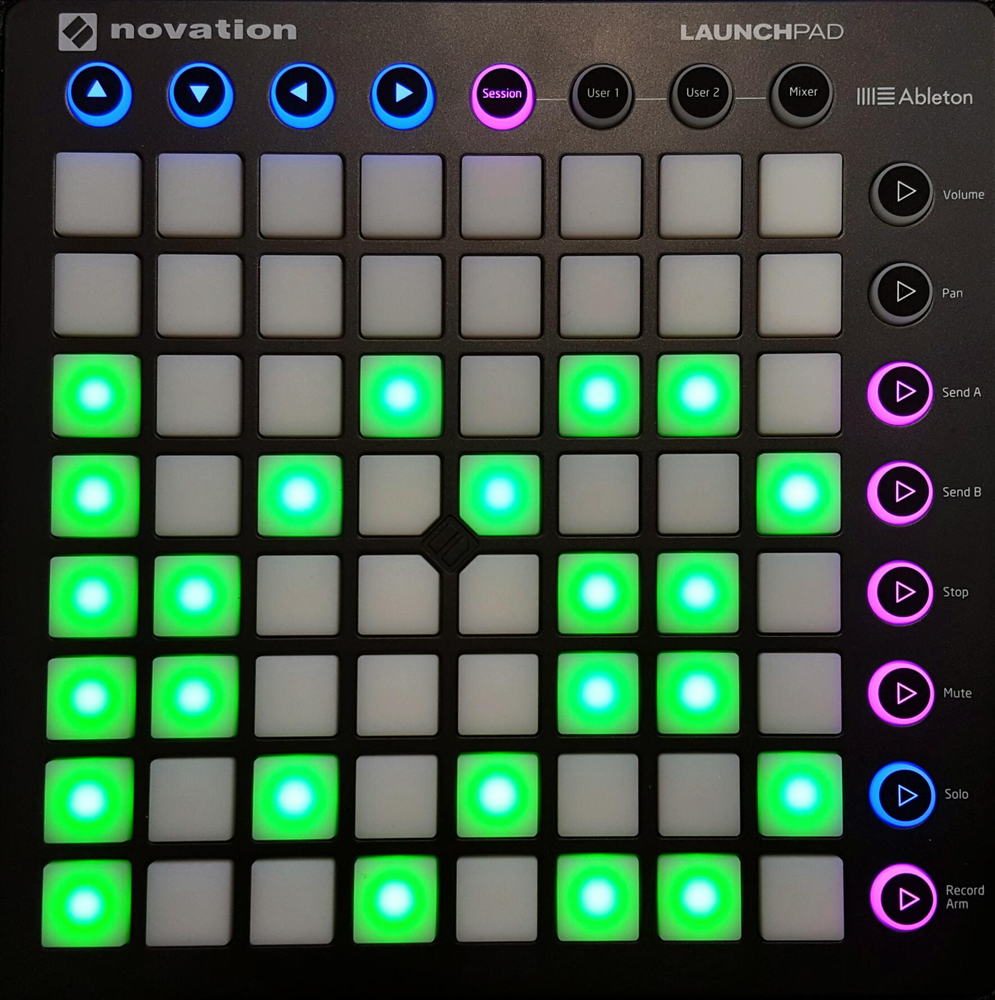

image:https://travis-ci.org/qaware/kubepad.svg?branch=master["Build Status", link="https://travis-ci.org/qaware/kubepad"]
image:https://img.shields.io/badge/license-MIT%20License-blue.svg["MIT License", link=https://github.com/qaware/kubepad/blob/master/LICENSE"]

= Kubepad

Remote control a Kubernetes or Marathon cluster using a Novation launchpad MIDI controller.

== Configuration

First of all you need a Kubernetes or Marathon cluster. You can access a local installation as
well as a remote master.

.Kubernetes
Make sure you have the proper configuration under `˜.kube/config`.
Additionally set your master URL and namespace in the cluster.properties file.
Then start Kubepad with the `-Dcluster.service=kubernetes` flag.

.Marathon / DCOS
Kubepad retrieves your URL and access token for DC/OS from a file named `dcos.toml`.
By default this file is in the `/.dcos` folder in your home directory.
You can overwrite its location in the `cluster.properties` file.
Then start Kubepad with the `-Dcluster.service=marathon` flag.

== Usage

Now you can start and use the Kubepad. Each row represents a running application, with
the square buttons representing instances. You can start and stop an instance by
directly pressing a square button. You can also select a row by pressing the buttons on
the right hand side. The cursors at the top can also be used to select the row (up and down)
and scale the row (left and right).

== Action Buttons

The four buttons on the right of the top row have a special meaning:

- Session (Red): Stops all apps.
- User 1 (Green): Ensures that at least one instance is running for every app.
- User 2 (Yellow): Reloads all apps.
- Mixer (Blue): Switches to snake-mode. (Return by pressing the yellow button.)

== Labels

The appearance of apps on the launchpad can be specified with following labels:

- `LAUNCHPAD_ENABLE`: set to `true or `false`, only when `true` this app is displayed.
- `LAUNCHPAD_COLOR`: Sets the color for all instances of the app on the launchpad.
  Can be either RED, ORANGE, YELLOW, LIGHT_GREEN, CYAN, LIGHT_BLUE, BLUE or PURPLE
- `LAUNCHPAD_ROW`: Displays the app in the specified row (0-7)
  if the row is not already assigned to another app.

== Leap Motion

You can also use a connected leap motion to control your cluster.
To enable this feature add the `-Dleapmotion.enabled` flag and point `-Djava.library.path` to your Leap motion libs.
Perform a swipe gesture to scale to 5 Pods (= 5 fingers). Use key tap or screen tap gestures to move the
row selection down or up.

== References

* http://www.thomann.de/de/novation_launchpad_mk2.htm[Novation Launchpad MK2]
* https://novationmusic.de/sites/default/files/novation/downloads/10529/launchpad-mk2-programmers-reference-guide_0.pdf[Launchpad MK2 Programmers Reference Guide]
* http://de.slideshare.net/kubecon/kubecon-eu-2016-kubernetes-hardware-hacks-exploring-the-kubernetes-api-through-knobs-faders-and-sliders[KubeCon EU 2016: Kubernetes Hardware Hacks: Exploring the Kubernetes API Through Knobs, Faders, and Sliders]
* https://github.com/fabric8io/fabric8/tree/master/components/kubernetes-api[Fabric8 Kubernetes API]
* https://github.com/fabric8io/kubernetes-client[Fabric8 Kubernetes Client]
* http://docs.oracle.com/javase/tutorial/sound/TOC.html[Java Sound Tutorial]
* http://docs.oracle.com/javase/tutorial/sound/MIDI-messages.html[Transmitting and Receiving MIDI Messages]
* https://docs.oracle.com/javase/8/docs/api/javax/sound/midi/package-summary.html[javax.sound.midi API]

== Maintainer

M.-Leander Reimer (@lreimer), <mario-leander.reimer@qaware.de>

== License

The software and documentation is provided under the MIT open source license,
read the `LICENSE` file for details.
